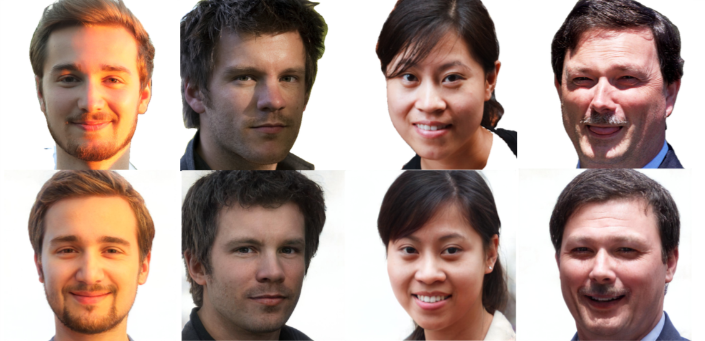

# GAN-based lighting correction on portrait images


This is the project page for "Unsupervised Shadow Removal and Relighting for Webcam Portrait Images with GANs" (paper submission in progress). We propose a framework for lighting correction on portrait images. This work is based on existing GAN-based approaches for portrait image generation and styletransfer.

The basic idea of this work is the following:
1. Project an image into the StyleGAN2 latent space to get the latent vector
2. Create (k) versions of the latent vector with random manipulations and generate the associated images 
   with the generator. There will be many images with different lighting conditions
3. Automatically select the image with the most homogenous lighting conditions

## Used Libraries ##
* The generator is based on [StyleGAN2-ada-PyTorch](https://github.com/NVlabs/stylegan2-ada-pytorch "StyleGAN2") 
and uses a pretrained model based on the [FFHQ-Dataset](https://github.com/NVlabs/ffhq-dataset "FFHQ-Dataset") 
(note: checkpoints can be found in its associated repositories )
* The encoder is provided by Tov et al.: [Encoder4Editing](https://github.com/omertov/encoder4editing "e4e"). It is used to find 
  the latent vector of an input image
* Image preprocessing contains two steps: alignment and background removal. The former is done by [FFHQ-Alignment](https://github.com/happy-jihye/FFHQ-Alignment "FFHQ-Alignment") and face masks for background removal were 
  generated by [Face-Parsing-PyTorch](https://github.com/zllrunning/face-parsing.PyTorch "Face-Parsing-PyTorch")
* In order to calculate how much shadow an image contains a [ST-CGAN](https://github.com/IsHYuhi/ST-CGAN_Stacked_Conditional_Generative_Adversarial_Networks "ST-CGAN") is used to generate shadow masks

## Used Hardware ##
CUDA is mandatory and for execution a Nvidia GTX 3070 (8GB) was used. If you want to train your own models you will 
need a **much** faster GPU. I experimented with two RTX Titans (24GB) and even then training of the generator and 
encoder takes each over one week.

## Used Software ##
* Ubuntu 20.04
* Python 3.6
* PyTorch 1.8.1
* CUDA 10.1

## Checkpoints ##
There are pretrained checkpoints which you can use. You will need a directory "checkpoints" containing the following 
files:
* [e4e_ffhq_encode.pt](https://drive.google.com/file/d/19y6pxOiJWB0NoG3fAZO9Eab66zkN9XIL/view "e4e") (e4e Encoder)
* [moco_v2_800ep_pretrain.pt](https://drive.google.com/file/d/1Zx-meLUN4J_tQSKJylZ4OZlhxNXuXLDq/view?usp=sharing) 
  (used by e4e)
* [model_ir_se50.pth](https://drive.google.com/file/d/1V7N3P0xk3WDmBF19nfPq5Bbmunj5WdK0/view?usp=sharing) (used by e4e)
* [stylegan2-ffhq-config-f.pt](https://drive.google.com/file/d/1EM87UquaoQmk17Q8d5kYIAHqu0dkYqdT/view "StyleGAN2") 
  (StyleGAN2-ada-PyTorch weights)

In addition download the [pretrained face parsing model ](https://drive.google.com/file/d/1jkUUUCdqoH_Nf7NtyvrocK8CENJJrSOc/view?usp=sharing) and place it under "models/face_parsing".
You will also need [checkpoints for the ST-CGAN](https://drive.google.com/file/d/1bo2OcLoBCD3R3CRJFVOz17v6PZgJVB6m/view?usp=sharing). Put them under "models/st_cgan"

## Edit images ##
After you have set up your environment and downloaded the checkpoints to the correct directories run the following 
command:

```
python inference.py --images_dir=/images/inputs --save_dir=/images/outputs/inversions --edit_attribute='inversion' --ckpt=/checkpoints/e4e_ffhq_encode.pt
```

This will iterate through all the images inside the "/images/inputs" directory. Under "/images/outputs/inversions" you 
will find the inversion aswell as the final result (the image with the most homogenous lighting).

## Parameters ##
You can improve the quality by creating many different variations of an input image. To tune it you can set the 
paramter "n_random_imgs" in "scripts/edit_latents.py". By default it is set to 300. Runtime will also increase if 
you set it to a higher value. Depending on the dataset you can also try to choose a different value for "value" 
(also in "scripts/edit_latents.py"). This affects how big or small the manipulation of the latent vector is.

## Known problems ##
* Inversion quality can vary depending on you dataset. If you are using your own images you will notice that there 
  is quite a big distortion. You can try to train your own generator or encoder model to better suit your own dataset.

## Acknowledgements ##
This work was part of my Master thesis at TU Dortmund University. I would like to thank my mentor aswell as all of 
the people that were involved.
